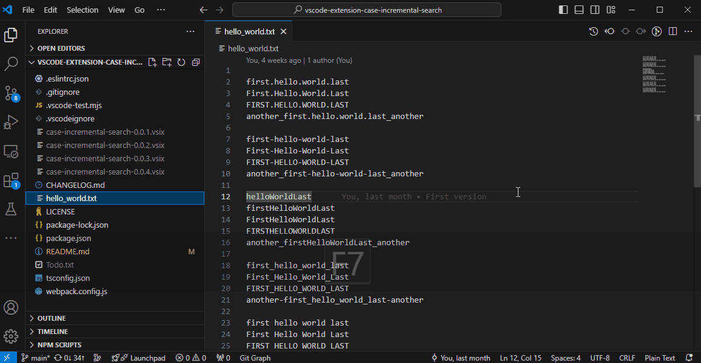
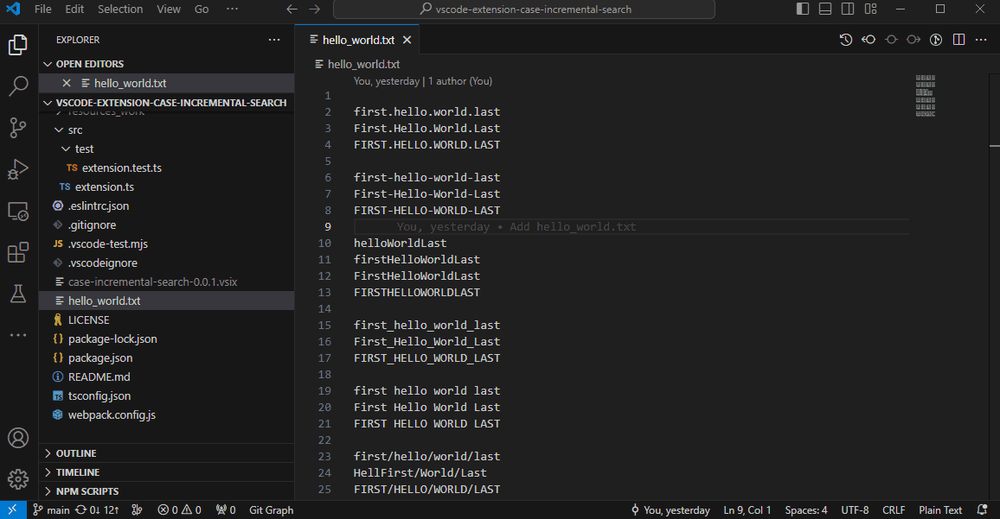
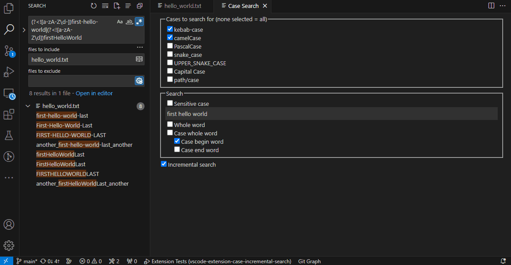
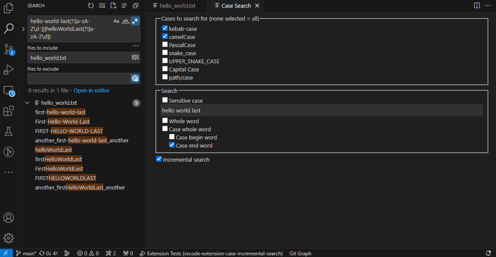
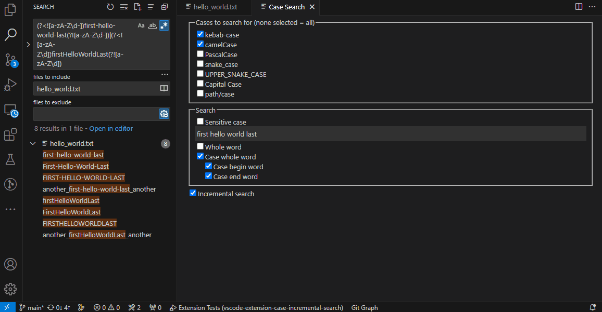

# Case Search

The extension is based on native search component.  
It searches for multiple forms of presentation of your query string.  
Supports the following cases:

* kebab-case
* camelCase
* PascalCase
* snake_case
* UPPER_SNAKE_CASE
* Capital Case
* path/case

If no case is specified, it defaults to **all cases**.

## Usage

The fastest way to use it is to use shortcut keys `Ctrl+F1`, `⌘+F1`.  
You can then select one or many appropriate cases.  
Input your query string for custom searching.  

Also, the search panel can be show up by invoking the command `Case Search: Incremental search by case` from the Command Palette.  
The Command Palette can be invoked by the shortcut key `Ctrl+⇧+P`, `⇧+⌘+P`.  

## Case Begin/End/Whole Word  

Can search for :  
- word at beggining  
- word at end  
- whole word  

Taking into account the separator of the selected cases  

Case Search for word at beggining :  

Case Search for word at end :  

Case Search for whole word :  

